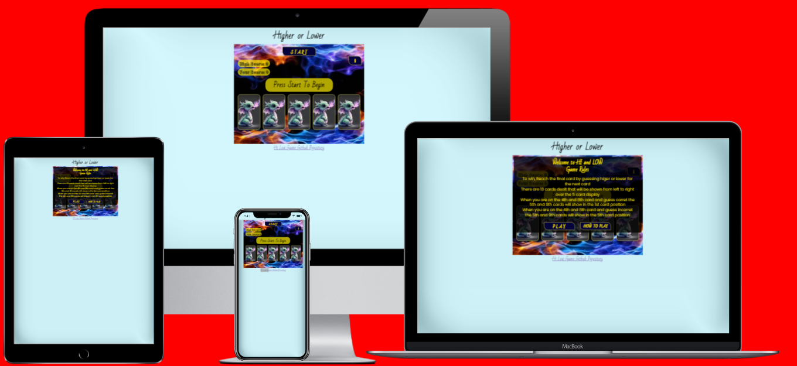
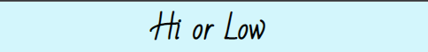
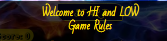
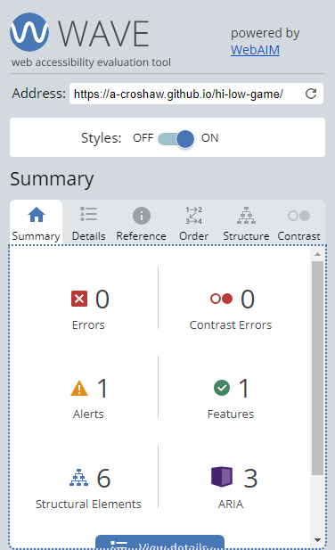
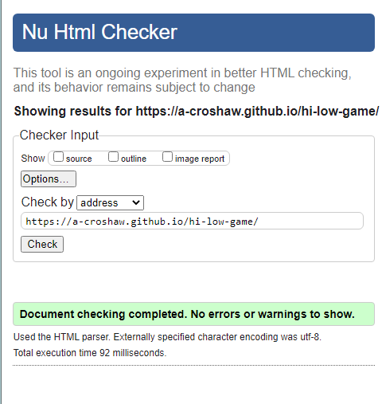
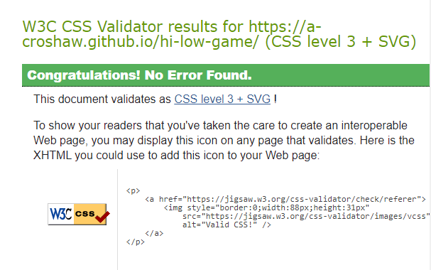
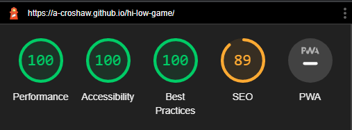
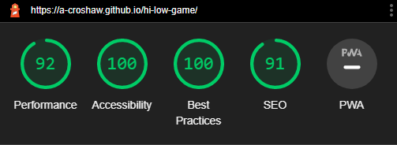

# _HI LOW GAME _

[__Click here to view published site__](https://a-croshaw.github.io/hi-low-game/)

# _Content Menu_

1. [Features](#features)
    1. [Elements](#elements)
        1. [The Background](#1---the-background)
        2. [Main Header](#2---main-header)
        3. [The Headers](#3---the-headers)
        4. [The Footer](#4---the-footer)
        5. [The Buttons](#5---the-buttons)
        6. [Favicon](#6---favicon)
    2. [The Game Content](#the-game-content)
        2. [The Main Content](#the-main-content)
    7. [404 Page](#404-page)
    8. [Implemented Features](#implemented-features)
    9. [Features to be Implemented](#features-to-be-implemented)
2. [Design](#design)
    1. [Index Page](#index-page)
3. [Bugs](#bugs)
4. [Testing](#testing)
    1. [Responsiveness](#responsiveness)
    2. [Navigation, External Links, and User Input Testing](#navigation-external-links-and-user-input-testing)
5. [Accessibility](#accessibility)
6. [Validation](#validation)
    1. [HTML Validation](#html-validation)
    2. [CSS Validation](#css-validation)
    3. [Lighthouse Reports](#lighthouse-reports)
        1. [Desktop](#desktop)
        2. [Mobile](#mobile)
7. [Depolyment](#deployment)
    1. [Version Control](#page-deployment)
    2. [Page Deployment](#page-deployment)
    3. [Cloning Repository](#cloning-repository)
8. [Credits](#credits)
    1. [Content and Media](#content-and-media)
    2. [Code](#code)

# _Features_

## _Elements_

The elements to this feature game are as followed:

### _1 - The Background_

 * The main background is a soft light blue #38d9f538 to make the main game area stand out 

 * whilst the background image to the game area is not visualy over powering to the rest of the elements within the game area.

### _2 - Main Header_

 * The main header is a simple black h2 element with the font of  "Bad Script" that is imported from Google fonts.

### _3 - The header_

 * The headers that are within the infomation window are yellow #f8df00. With the font of  "Bad Script" that is imported from Google fonts.

### _4 - The Footer_

 * The footer reads "Hi Low Game Github Repository" which link to the github repository for this game.

 * It is just a simple text format using the font "Bad Script" that is imported from Google fonts.

### _5 - The Footer_

### _6 - Favicon_

 * 

 * 

## _The Game Content_

### _The Main Content_

 * 

 * 

 * 

 * 

 * 

 * 

## _404 Page_

 * This 404 page will be reached when a bad link or a miss-typed web address is loaded by the user.

 * It consists of the top header and navigation bar with logos so the user can navigate back to the website more easily.

 * Also there is a link in the word here within the text that will take the user back to the home page.

 * This is all so the user does not have to use the back button on the browser or type the URL to return to the site.

## _Implemented Features_
 
 * 

 * 

 * 
 
 * 
 
 * 
 
 * 
 
 * 

## _Features to be Implemented_

 * 

 * 

 *  

 * 

# _Design_
 

## _Index Page_

 * 
 
 * 

 * 

 

# _Bugs_

 * There are no known bugs within the site after testing on multiple devises.

# _Testing_

## _Responsiveness_

 * The site has been tested on Edge, Safari, Chrome, Firefox, and Opera.

 * Devices the site has been tested on are Samsung 22 + 10 lite, Iphone 11 + 13, PC, and Lenovo tablet.

 * The site has been fully tested using google developer on all screen sizes from 280px and up.

 * The site is fully responsive across all the devices with the screens vertically and horizontally.

 * There are no horizontal scrolls when tested across these devices.

 * The images do not become pixelated.
 
 * None of the content overlaps when screen size reduces.

## _Navigation, External Links, and User Input Testing_

 * These have been tested on Edge, Safari, Chrome, Firefox, and Opera

 * Devices these have been tested on are Samsung 22 + 10 lite, Iphone 11 + 13, PC, and Lenovo tablet.

 * All navigation, external links, and user inputs work across all responsive screen sizes and on all tested devices.

# _Accessibility_

 * The page accessibility was checked using [Wave](https://wave.webaim.org/)

 * Index.html has one alert for saying text maybe a heading when it was not.
 
 * All links have proper aria labels.

* There is no conflicts with the contrast of colours.

# _Validation_

## _HTML Validation_

* The HTML on all pages passed through the [W3C validator](https://validator.w3.org/) without any errors.

## _CSS Validation_

* The CSS code passed through the [Jigsaw validator](https://jigsaw.w3.org/css-validator/) without any errors.

## _Lighthouse Reports_

### _Desktop_

 * index.html

### _Mobile_

 * index.html

# _Deployment_

## _Version Control_

 * From the Gitpod terminal use "git add ." which tells git you would like to make changes/updates to the files.

 * Then use "git commit -m " with a comment, this will commit the changes and update the files.

 * Then using the "git push" command this will push the committed changes to your GitHub repository.

## _Page Deployment_

 * Load up the GitHub website and log in to your account
 
 * Select and open the repository to be published.

 * Click on the settings within this repository and scroll down and open the pages section.

 * Under the build and deployment section within pages put the source to display a branch, select the branch to main and the folder to root, and hit the save button.

 * Then select the visit site button at the top to view the live deployment of the site.

 Visit the live deployment of the site [HERE](https://a-croshaw.github.io/hi-low-game/).

## _Cloning Repository_

 * To clone the repository for download or use within your GitHub head-over to this link https://github.com/git-guides/git-clone

# _Credits_

## _Content and Media_

 *  The image used for the back of the card was taken from [Pixabay](https://pixabay.com/illustrations/ai-generated-baby-dragon-cute-7705365/) and is free licensed under the Pixabay licensing condtions.

 * The image used fro the background of the game are is from [Wallpapers.com](https://wallpapers.com/wallpapers/blue-and-red-fire-j9nfqyrlnhxznmh5.html) with under there licensing the image is only for personal use. As this is a personal and project for education perpose this image can not be published out side of this scope.

## _Code_

 * For the font style's Prata and Slabo, These are from [Google-Fonts](https://fonts.google.com/).
 
 * The Favicon code and image icon rendering was produced using [favicon.io](https://favicon.io/).

 * The social media icons used, are provided by [Font Awesome](https://fontawesome.com/).
 
 * The use of the [Web Dev Simplified](https://www.youtube.com/watch?v=NxRwIZWjLtE) YouTube tutorials was used to help code the card deck. 

 * For the understanding and coding HTML, CSS and Javascript [W3Schools](https://www.w3schools.com/js/default.asp) also [Stack Overflow](https://stackoverflow.com/tags)and was used.

 * The 

 * For the understanding and css code for aligning flexbox [flexboxfroggy](https://flexboxfroggy.com/) was used.

 * To create the screen mockup i used [techsini.com](https://techsini.com/multi-mockup/index.php).
