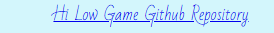

# _HI LOW GAME _

[__Click here to view published site__](https://a-croshaw.github.io/hi-low-game/)

# _Content Menu_

1. [Features](#features)
    1. [Elements](#elements)
        1. [The Background](#1---the-background)
        2. [Main Header](#2---main-header)
        3. [The Headers](#3---the-headers)
        4. [The Footer](#4---the-footer)
        5. [The Buttons](#5---the-buttons)
            1. [Game Information Buttons](#1---game-information-buttons)
            2. [Start and Restart Buttons](#2---start-and-restart-buttons)
            3. [Hi and low Buttons](#3---hi-and-low-buttons)
        6. [Scores](#6---scores)
        7. [Game Text](#7---game-text)
        8. [Cards](#8---cards)
        9. [Information Window](#9---information-window)
        10. [Favicon](#10---favicon)
    7. [404 Page](#404-page)
    8. [Implemented Features](#implemented-features)
    9. [Features to be Implemented](#features-to-be-implemented)
2. [Design](#design)
    1. [Index Page](#index-page)
3. [Bugs](#bugs)
4. [Testing](#testing)
    1. [Responsiveness](#1---responsiveness)
    2. [Navigation, External Links, and User Input Testing](#2---navigation-external-links-and-user-input-testing)
5. [Accessibility](#accessibility)
6. [Validation](#validation)
    1. [HTML Validation](#1---html-validation)
    2. [CSS Validation](#2---css-validation)
    3. [Lighthouse Reports](#3---lighthouse-reports)
        1. [Desktop](#1---desktop)
        2. [Mobile](#2---mobile)
7. [Depolyment](#deployment)
    1. [Version Control](#1---page-deployment)
    2. [Page Deployment](#2---page-deployment)
    3. [Cloning Repository](#3---cloning-repository)
8. [Credits](#credits)
    1. [Content and Media](#1---content-and-media)
    2. [Code](#2---code)

# _Features_

## _Elements_

The elements to this feature game are as followed:

### _1 - The Background_

 * The main background is a soft light blue #38d9f538 to make the main game area stand out 

 * whilst the background image to the game area is not visualy over powering to the rest of the elements within the game area.

### _2 - Main Header_

 * The main header is a simple black h2 element with the font of  "Bad Script" that is imported from Google fonts.

### _3 - The header_

 * The headers that are within the infomation window are yellow #f8df00. With the font of  "Bad Script" that is imported from Google fonts.

### _4 - The Footer_

 * The footer reads "Hi Low Game Github Repository" which link to the github repository for this game.

 * It is just a simple text format using the font "Bad Script" that is imported from Google fonts.

### _5 - The Buttons_

 * All the buttons through the game have the same style.
 * They are a beep blue color #04033b and when hovered over change to a lighter blue #06056d.
 * They all consist of yellow text #ffe600.
 * They all have the font "Bad Script" that is imported from Google fonts.
 * They all consist of a sold yellow border #faf761.
 * They all have all have two coners rounded.

#### _1 - Game Information Buttons_

 * Within the game information section shows two buttons a "play" and "how to play".
 * When the "how to play" button is pressed it changes to the "game rules" button.
 * When the "play" button is press it hides the information window to allow you to play the game.

 * Within the main game area the "i" button opens up the information window.

#### _2 - Start and Restart Buttons_

 * Within the main game area the "start" button will show soon as the information window is closed.
 * When the start button is pressed the "restart" button will show which will remain untill the game is fully restarted.

#### _3 - Hi and Low Buttons_

 * The "hi" and "low buttons only appear once the start button is pressed.
 * The "hi" and "low" buttons are allow yopu to select hi or low options when the game is started. 

### _6 - Scores_

 * The scores are to the right top side of the game area.
 * With the background as a lightly transparent yellow #ffee00b2.
 * The text has a font of 'Rampart One' which is imported from google fonts.

### _7 - Game Text_
* The Game test area is placed above the card in the middle of the game area.
* The Text has the font "Bad Script" that is imported from Google fonts.
* With the background as a lightly transparent yellow #ffee00b2.

### _8 - Cards_

 * The cards are static with the back displaying a little dragon.
 * Once the cards Turn they will minic the design of a normal deck of cards with the exception of the 
    king, queen and jack which dont show the pictures just the letters.

### _9 - Information Window_

* The information window is displayed as soon as the game is loaded.
* The Text has the font "Bad Script" that is imported from Google fonts.
* The text color is yellow #f8df00.
* With the background as a lightly transparent black #000000c4.
* The "how to play" and "game rules" buttons toggle between to sets of information within the same window"

### _10 - Favicon_

 * 

## _404 Page_

## _Implemented Features_
 
 * The responsiveness of the site is 280px and up.

 * All external links open up as they should on all devices.
 
 * Buttons that call different functions to operate the game.
 
 * Element to track a users higest score within that game session.
 (not linked to external storage to keep highest score from refreshing when page reloads) 
 
 * 404 page to let the user know there is a broken link or a mistype in the URL.
 
 * 404 page has a navigation bar and also a link in content to return to the main content of the site. 
 
## _Features to be Implemented_

# _Design_
 
# _Bugs_

 * There are no known bugs within the site after testing on multiple devises.

# _Testing_

## _1 - Responsiveness_

 * The site has been tested on Edge, Safari, Chrome, Firefox, and Opera.

 * Devices the site has been tested on are Samsung 22 + 10 lite, Iphone 11 + 13, PC, and Lenovo tablet.

 * The site has been fully tested using google developer on all screen sizes from 280px and up.

 * The site is fully responsive across all the devices with the screens vertically and horizontally.

 * There are no horizontal scrolls when tested across these devices.

 * The images do not become pixelated.
 
 * None of the content overlaps when screen size reduces.

## _2 - Navigation, External Links, and User Input Testing_

 * These have been tested on Edge, Safari, Chrome, Firefox, and Opera

 * Devices these have been tested on are Samsung 22 + 10 lite, Iphone 11 + 13, PC, and Lenovo tablet.

 * All navigation, external links, and user inputs work across all responsive screen sizes and on all tested devices.

# _Accessibility_

 * The page accessibility was checked using [Wave](https://wave.webaim.org/)

 * Index.html has one alert for saying text maybe a heading when it was not.
 
 * All links have proper aria labels.

* There is no conflicts with the contrast of colours.

# _Validation_

## _1 - HTML Validation_

* The HTML on all pages passed through the [W3C validator](https://validator.w3.org/) without any errors.

## _2 - CSS Validation_

* The CSS code passed through the [Jigsaw validator](https://jigsaw.w3.org/css-validator/) without any errors.

## _3 - Lighthouse Reports_

### _1 - Desktop_

 * index.html

### _2 - Mobile_

 * index.html

# _Deployment_

## _1 - Version Control_

 * From the Gitpod terminal use "git add ." which tells git you would like to make changes/updates to the files.

 * Then use "git commit -m " with a comment, this will commit the changes and update the files.

 * Then using the "git push" command this will push the committed changes to your GitHub repository.

## _2 - Page Deployment_

 * Load up the GitHub website and log in to your account
 
 * Select and open the repository to be published.

 * Click on the settings within this repository and scroll down and open the pages section.

 * Under the build and deployment section within pages put the source to display a branch, select the branch to main and the folder to root, and hit the save button.

 * Then select the visit site button at the top to view the live deployment of the site.

 Visit the live deployment of the site [HERE](https://a-croshaw.github.io/hi-low-game/).

## _3 - Cloning Repository_

 * To clone the repository for download or use within your GitHub head-over to this link https://github.com/git-guides/git-clone

# _Credits_

## _ 1 - Content and Media_

 *  The image used for the back of the card was taken from [Pixabay](https://pixabay.com/illustrations/ai-generated-baby-dragon-cute-7705365/) and is free licensed under the Pixabay licensing condtions.

 * The image used fro the background of the game are is from [Wallpapers.com](https://wallpapers.com/wallpapers/blue-and-red-fire-j9nfqyrlnhxznmh5.html) with under there licensing the image is only for personal use. As this is a personal and project for education perpose this image can not be published out side of this scope.

## _2 - Code_

 * For the font style's Prata and Slabo, These are from [Google-Fonts](https://fonts.google.com/).
 
 * The Favicon code and image icon rendering was produced using [favicon.io](https://favicon.io/).

 * The social media icons used, are provided by [Font Awesome](https://fontawesome.com/).
 
 * The use of the [Web Dev Simplified](https://www.youtube.com/watch?v=NxRwIZWjLtE) YouTube tutorials was used to help code the card deck. 

 * For the understanding and coding HTML, CSS and Javascript [W3Schools](https://www.w3schools.com/js/default.asp) also [Stack Overflow](https://stackoverflow.com/tags)and was used.

 * The 

 * For the understanding and css code for aligning flexbox [flexboxfroggy](https://flexboxfroggy.com/) was used.

 * To create the screen mockup i used [techsini.com](https://techsini.com/multi-mockup/index.php).
